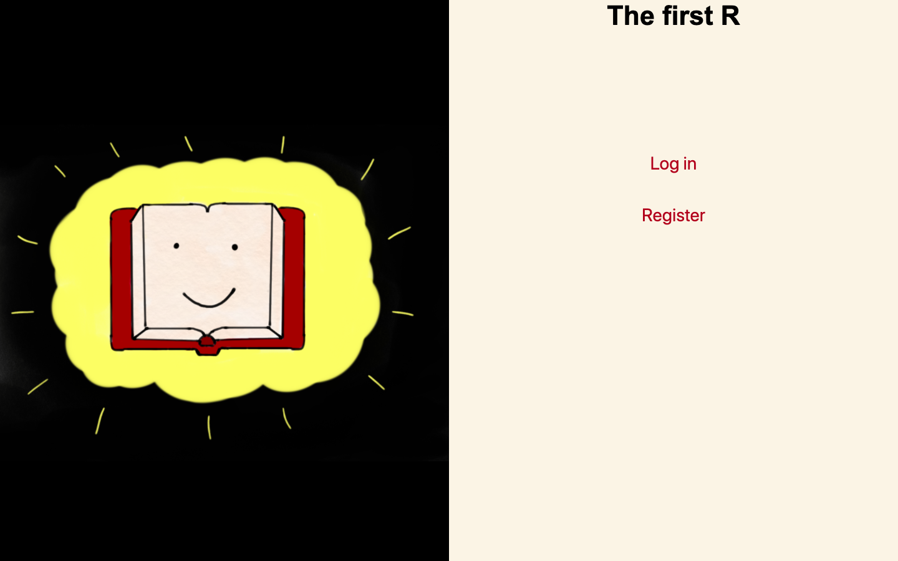
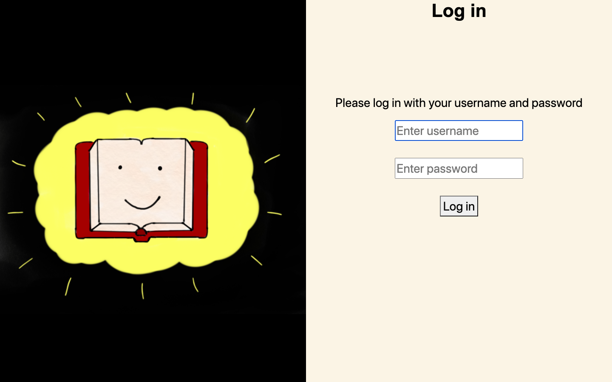
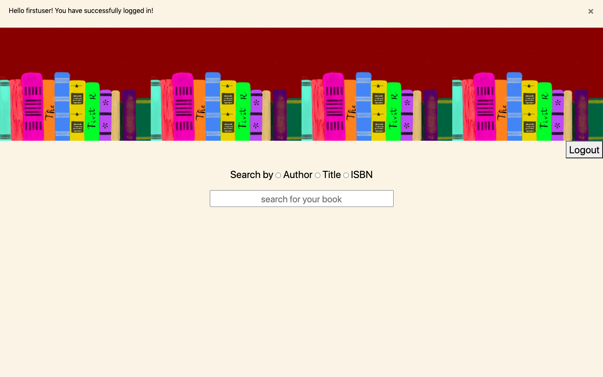
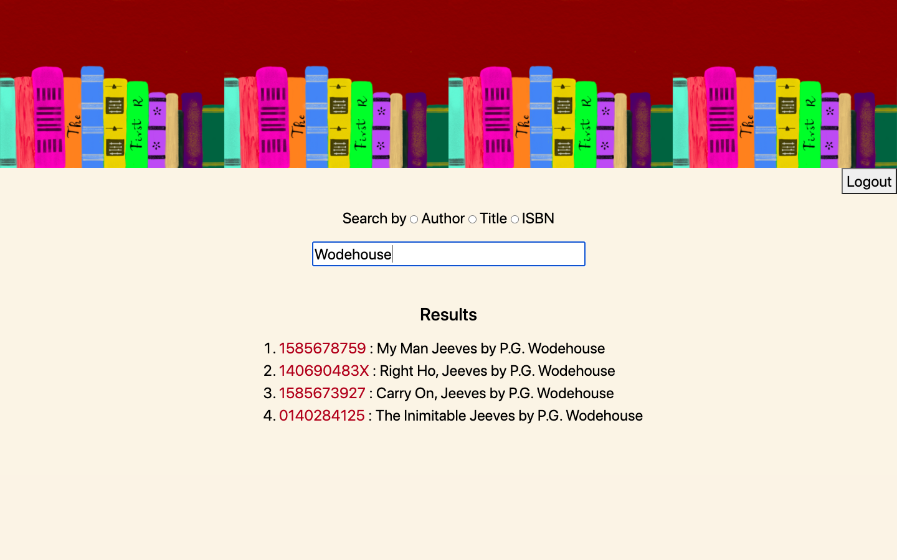
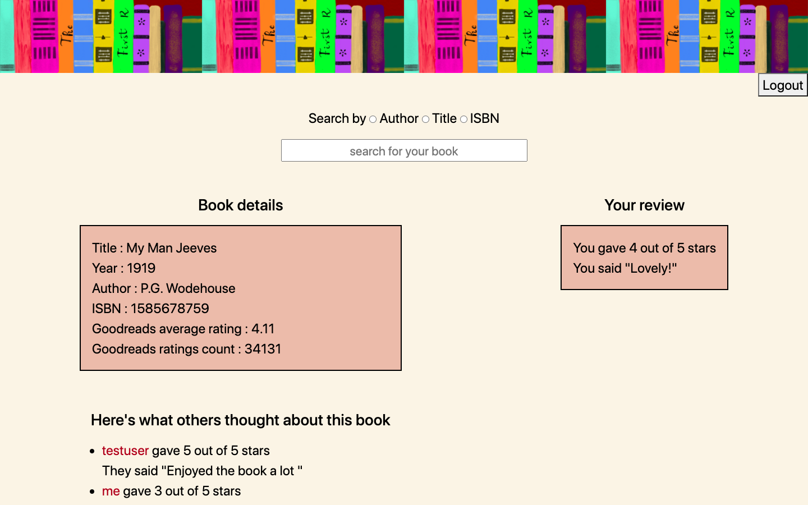

# The First R - _for you, dear reader_

A Flask web application where readers can sign up, log in and look up books and read and write reviews for them.
The application also uses Goodreads API to pull up Goodreads data for queried books  
Finally, the web app comes with API access for users to query details about a book with its ISBN `(/api<isbn>)`

## Contents

### Python Code  
* [application.py](application.py)  - Flask code for web application  
* [import.py](import.py) - Python code to populate the database with data from books.csv 

### HTML and CSS  
* [templates](templates) - Folder containing html files
* [static](static) - Folder containing static files (css + images)

### Other code and data files
* [requirements.txt](requirements.txt) - Python packages needed to run web application  
* [books.csv](books.csv) - Book data  
* [createtable_SQLcommands](createtable_SQLcommands.txt) - SQL commands for creating tables in database
* [populate_db.sh](populate_db.sh) - Bash script to populate the database (need to set env variable for database url)  
* [start_flask.sh](start_flask.sh) - Bash script to run the flask application (need to set env variable for databse url and goodreads developer key)

## Screenshots from the web-app 

* Index page  

* Log in page  (registration looks similar)  

* Main page after logging in  

* Search results page  

* Details of a particular book page  

## Comments  

* Used Heroku to create and host the database for the application  
* books.csv was the file with data of 5000 books used to populate the database. Here, a sample file with 10 books is given
* The 3 Rs refer to Reading, wRiting, and aRithmentic, hence the title (in case you were wondering!)
* psst.. the images used in the website are hand drawn :smiley:  

